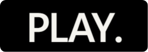
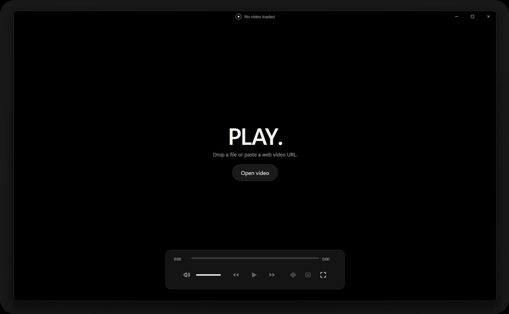

# PLAY.

Website: https://stephanorgiazzi.github.io/playdot-player/

[](https://tauri.app/)
[](https://react.dev/)
[](https://www.typescriptlang.org/)
[](https://vite.dev/)
[](https://mpv.io/)
[](#quick-start-development)
[](LICENSE)
[](#open-source)

<p align="center">
  
</p>

## Premium video playback on Windows

_PLAY._ is an open source premium video player for Windows built around one goal: **deliver a better viewing experience**. It combines **broad real-world media compatibility**, **high-performance playback**, **strong rendering quality**, and a polished desktop presentation in one focused app.

<p align="center">
  
</p>

**Why it stands out**

- **Excellent compatibility** across modern and legacy containers, codecs, tracks, and demanding files
- **Strong playback performance** on high resolutions, high bitrates, and complex media libraries
- **Better image presentation** with high-quality scaling, tone mapping, and sharper overall rendering
- **Better HDR-to-SDR viewing results** than many mainstream desktop players
- **Built-in `FSR` upscaling** for sharper playback when you want more from lower-resolution sources
- **Optional `SVP` integration** for high-frame-rate motion interpolation on systems that have it installed
- **Premium desktop feel** with fast controls, polished interaction, and a player UI built around the video

## Contents

- [Why PLAY.](#why-play)
- [Playback Strengths](#playback-strengths)
- [Experience](#experience)
- [Architecture](#architecture)
- [Stack](#stack)
- [Quick Start (Development)](#quick-start-development)
- [Quality Checks](#quality-checks)
- [Build and Release](#build-and-release)
- [Scripts](#scripts)
- [Open Source](#open-source)

## Why PLAY.

**PLAY. is built to be the premium Windows video player:** _fast, capable, and visibly better where it matters most_ — **playback quality, compatibility, and responsiveness**.

- **Open local files** fast
- **Support pasted `http` and `https` media URLs**
- **Launch directly** from associated video files
- **Control playback** with keyboard, mouse, wheel, and context menu workflows
- **Stay focused on the video** instead of clutter

## Playback Strengths

The playback stack is what gives _PLAY._ its edge, and that advantage carries directly into the app experience.

- **Broad real-world compatibility** inherited from `mpv`
- **Strong responsiveness** on demanding files
- **High-quality scaling and tone mapping**
- **Better SDR presentation from HDR sources**
- **Built-in `FSR` upscaling** as a first-class playback enhancement
- **Optional `SVP` integration** for users who want smoother interpolated motion
- **Reliable handling** of audio tracks, subtitle tracks, and common playback adjustments

## Playback Enhancements

Two standout features make _PLAY._ more than just a polished player.

- **`FSR` upscaling** improves perceived sharpness and presentation, especially when lower-resolution content is shown larger
- **`SVP` integration** lets PLAY. use an installed SVP setup for motion interpolation and smoother high-frame-rate playback

## Experience

1. **Open** a file or paste a media URL.
2. **Get smooth playback** with high image quality and strong format support.
3. **Scrub, seek, adjust volume, and change playback settings** instantly.
4. **Turn on `FSR` upscaling** or use installed `SVP` integration when you want a more enhanced viewing experience.
5. **Cycle audio and subtitles**, adjust subtitle size, toggle fullscreen, and tune the viewing experience without friction.

Current feature set includes:

- **Timeline scrubbing** with hover time preview
- **Audio and subtitle track cycling**
- **Fullscreen toggle** and playback speed controls
- **Subtitle size adjustment**
- **`FSR` upscaling toggle**
- **Optional `SVP` integration** when installed locally

## Architecture

- **Rust** hosts the Tauri 2 shell, startup media argument handling, native integrations, and window lifecycle
- **React** and **TypeScript** own the player UI, shortcuts, chrome behavior, and control flow
- **`tauri-plugin-libmpv`** drives playback and observed player state
- **Bundled runtime libraries and shaders** let the app ship as a self-contained Windows desktop app

## Stack

- Tauri 2
- Rust
- React 19
- TypeScript 6
- Vite 8
- libmpv via `tauri-plugin-libmpv`
- `oxlint` and `oxfmt`

## Quick Start (Development)

```bash
npm install
npm run setup-lib
npm run app:dev
```

Notes:

- `npm run setup-lib` prepares `src-tauri/lib/` with the required `mpv` runtime files
- `npm run app:dev` starts the `Vite` frontend and the `Tauri` desktop app together
- _This project is intended for Windows development and packaging_

## Quality Checks

```bash
npm run lint
npm run format
npm run build
```

## Build and Release

Build the app:

```bash
npm run tauri:build
```

Create the Windows installer and release artifacts:

```bash
npm run release
```

Outputs are written under `src-tauri/target/release/bundle/` and `release/`.

## Scripts

| Command               | Description                             |
| --------------------- | --------------------------------------- |
| `npm run app:dev`     | Run full Tauri desktop development mode |
| `npm run build`       | Type-check and build the frontend       |
| `npm run lint`        | Run `oxlint` with the project rules     |
| `npm run tauri:build` | Build desktop bundles                   |
| `npm run setup-lib`   | Prepare bundled libmpv runtime files    |
| `npm run release`     | Build installer and local artifacts     |

## Open Source

PLAY. is MIT licensed. See `LICENSE`.
